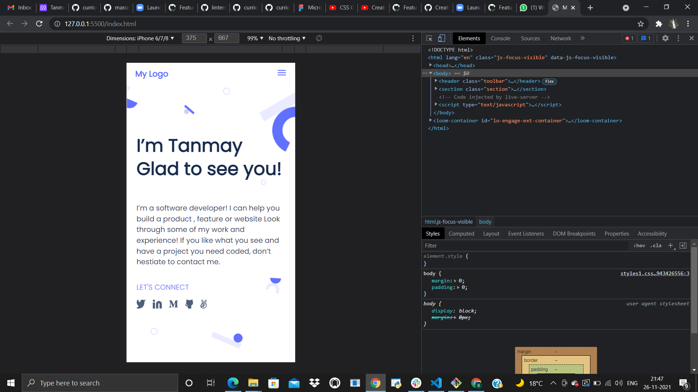

# MyPortFolio Project

> This project is based on my portfolio and is made with help of figma,html and css.

It contains links to my personal pages.

## Built With

- HTML, CSS
- Figma, Linters and VSCODE

## Authors

👤 **Author1**

- GitHub: [@tanmaytyagi556](https://github.com/tanmaytyagi556)
- Twitter: [@Tanmay_Tyagi556](https://twitter.com/Tanmay_Tyagi556)
- LinkedIn: [Tanmay](https://www.linkedin.com/in/tanmay-tyagi-4bb3b91aa/)

## Getting Started
To start with this project, this repository must be run on a web browser and also calls for a basic understanding of HTML, CSS and Linters.

## 🤝 Contributing

Contributions, issues, and feature requests are welcome!

Feel free to check the [issues page](../../issues/).

## Show your support

Give a ⭐️ if you like this project!

## Acknowledgments

- Hat tip to anyone whose code was used
- Inspiration
- etc

## 📝 License

This project is [MIT](./MIT.md) licensed.
